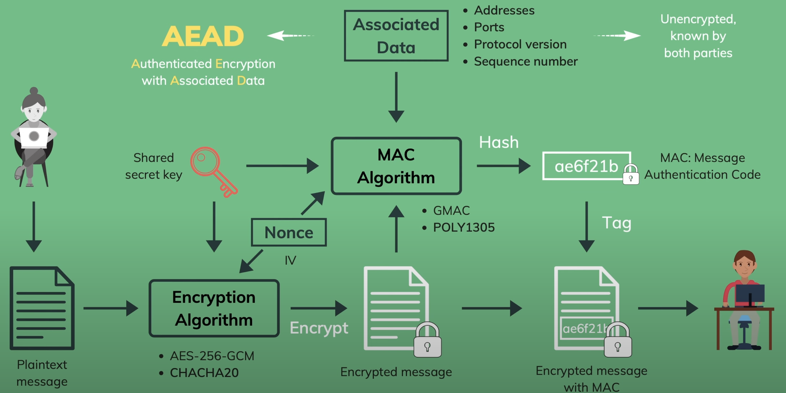
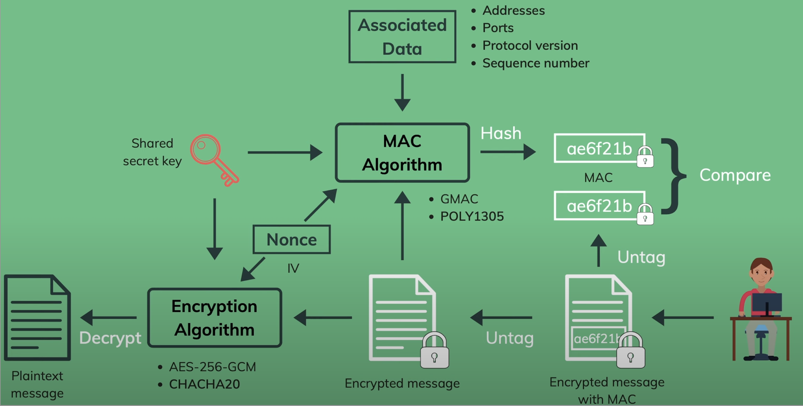

# SSL/TLS

* Handshake
* Symmetric cryptography
* Asymmetric cryptography
* Elliptic-curve cryptography
* Digital certificates
* Certificate authority
* Digital signature
* Diffie Hellman
* Message authentication code
* Bit-flipping attack
* Quantum-computing attack
* HKDF
* O-RTT
* AEAD

Secure Socket Layer (SSL): The predecessor of TLS

Transport Layer Security (TLS): `A cryptographic protocol that provides secure communication over a computer network`

## Why TLS?

- Authentication: Verify the identity of the communicating parties with asymmetric cryptography

- Confidentiality: Protect the exchanged data from unauthorized access with symmetric cryptography

- Integrity: Prevent alteration of data during transmission with message authentication code

## How TLS works?

1. Handshake protocol
- Negotiate TLS protocol version
- Select cryptographic algorithms: cipher suites
- Authenticate by asymmetric cryptography
- Establish a secret key for symmetric encryption

2. Record protocol
- Encrypt outgoing messages with the secret key
- Transmit the encrypted message
- Decrypt incoming messages with the secret key
- Verify that the message are not modified

## Why using both symmetric and asymmetric cryptography?

- Symmetric cryptography cannot be used for authentication, key sharing is hard
- Asymmetric cryptography is much slower, thus not suitable bulk encryption

## Symmetric Cryptography

Encrypt: Plaintext message -> (Shared secret key) -> Encrypted message

Decrypt: Encrypted message -> (Shared secret key) -> Plaintext message

## Bit-Flipping attack

Encrypt: Plaintext message -> (Shared secret key) -> Encrypted message -> Bit-Flipping -> Other Encrypted message

Decrypt: Other Encrypted message -> (Shard secret key) -> Other Plaintext message 

## AEAD (`Authenticated Encryption with Associated Data`)

Authenticated Encrypted

1. Plaintext message -> (Encryption Algorithm / Shared secret key / Nonce) -> (Encrypt) -> Encrypted message
2. (Encrypted message / Shard secret key / Nonce) -> MAC Algorithm -> (Hash) -> MAC:message Authentication Code
3. Encrypted message + MAC:message Authentication Code(Tag) -> Encrypted message with MAC

TLS1.3
Associated Data (Addresses, Ports, Protocol version, Sequence number) (MAC Algorithm) -> Unencrypted, known by both parties

## Decryption Verification
1. Encrypted message With MAC -> (Untag) -> Encrypted message + MAC(1)
2. Encrypted message + Shard secret key + Nonce -> MAC Algorithm -> (Hash) -> MAC(2)
3. MAC(1) Compare MAC(2)
4. Encrypted message + Shard secret key + Nonce -> Encryption Algorithm -> Plaintext message

## Key exchange

Asymmetric(Public-Key)Cryptography

* Diffie-Hellman Ephemeral(DHE)
* Elliptic Curve Diffie-Hellman Ephemeral(ECDHE)

## Asymmetric Cryptography

Key Exchange
- Diffie-Hellman Ephemeral(DHE)
- Elliptic-Curve Diffie-Hellman Ephemeral(ECDHE)
- RSA(removed in TLS 1.3: attacks & no forward-secrecy)

Encryption System
- RAS with Optimal Asymmetric Encryption Padding (RSA-OAEP)
- RAS with Public Key Cryptography Standard #1 (RSA-PKCS1-v2.2)
- ELGamal Encryption

Digital Signature
- RSA with Probabilistic Signature Scheme(RSA-PSS)
- Elliptic-Curve Digital Signature Algorithm(ECDSA)
- Edwards-Curve Digital Signature Algorithm(EdDSA)

## Certificate Signing

1. Emory creates a Certificate Signing Request
2. Emory's signs the CSR (use Emory's private key)
3. CA verifies identity & signature
4. CA signs the certificate (use CA's private key)

## Certificate Sharing

1. Emory sends this signed certificate
2. Other user verifies the certificate (use CA's public key)
